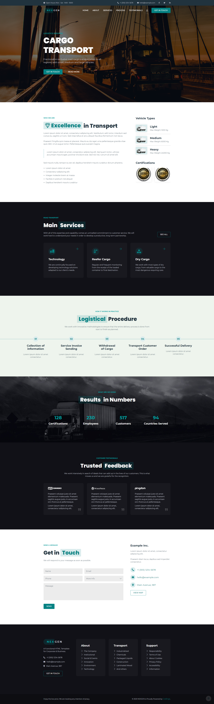

# NEX GEN Cargo Transport
## Analisi layout
<!--  -->
Possibile struttura in App.vue:
-   TheHeader.vue
    - div "info-bar" superiore fissa
    - NavBar.vue
    - div "jumbotron" e all'interno NavBar.vue? 

-   TheMain.vue - 
suddiviso in 6 section
    1. WHO WE ARE - bianco, con paragrafo descrittivo e lista Vehicle Types
    2. ROAD TRANSPORT - nero con card 
    3. HOW IT WORKS IN PRACTICE - bianco con road-map lineare
    4. WHAT ARE WE DOING - banner image con col di numeri
    5. CUSTOM TESTIMONIALS - nero con card
    6. SEND A MESSAGE - bianco con form e info

- TheFooter.vue
    - info company (stesse di form e info-bar)
    - 3 card con lista link
    - extra footer stile barra